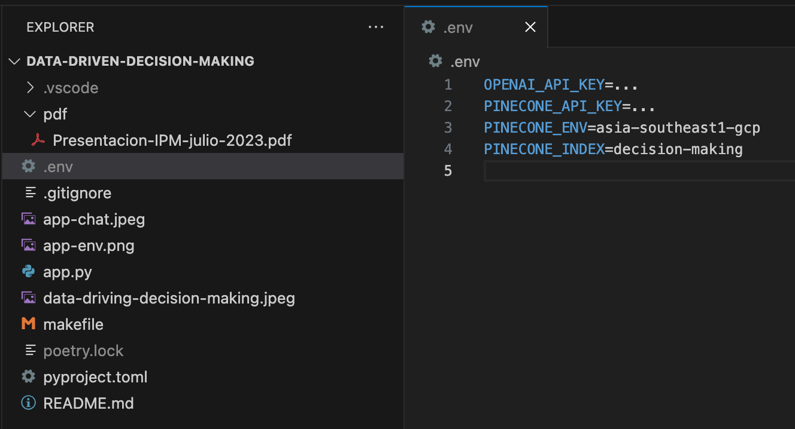

# Dialogue with your Documents for Data-Driven Decision Making

When I started developing this application, my goal was to build an interactive and intelligent document reader.

- https://www.josoroma.com/dialogue-with-your-documents-for-data-driven-decision-making

I wanted users to upload a document, ask a question about it, and have an AI generate responses based on the document’s content. So, here’s how I put everything together:


## Setup Environment, Add Packages and Run App

```
make setup
make add
make run
```

### makefile

```
setup:
	poetry install
	poetry env use `which python3.11`
	poetry shell

add:
	poetry add streamlit streamlit_chat streamlit_extras langchain openai tiktoken pypdf pinecone-client

run:
	poetry run streamlit run app.py

clean:
	rm -rf `poetry env info -p`
	rm -rf poetry.lock
```

## OpenAI and Pinecone

First, I created a user-friendly sidebar for users to input their API keys and environment variables. This is the first interaction point between the user and the application. The application relies on OpenAI and Pinecone for retrieving information and generating responses, hence the necessity of API keys.

If you do not have a .env file with the necessary environment variables to use LangChain and Pinecone, the sidebar will not ask you for these details but will recognize them.



## PyPDFLoader

Once the user has input the API keys and environment variables, they can choose to upload a file.

If the “Enable file upload” checkbox is ticked, a file uploader widget appears, where the user can upload a PDF document.

If a user chooses to upload a document, the application reads the uploaded PDF, divides it into individual pages using the PyPDFLoader, and creates a searchable vectorstore index using Pinecone.

## Transform Chunks of Text to Vector Embeddings

The embedding before going to the vectorstore essentially converts the text into a mathematical representation that can be efficiently searched and compared, providing the backbone for our question-answering system.

## Ask anything about the document


Now that the vectorstore index is ready, the user can input a question or prompt related to the uploaded document. When the user submits a question, the application triggers the generate_response() function. This function utilizes OpenAI’s GPT model to generate an answer based on the vector representation of the document in the vectorstore.

### But what if the user wants to ask a question about a document they’ve already uploaded?

No worries, I’ve got that covered. If the user doesn’t choose to upload a new document, the application assumes they’re referring to the previously uploaded document. It uses the default vectorstore index that was created from the last document upload and answers the new question based on that data.

## Conversation History

Every response generated is then stored in a session state variable, enabling us to maintain a conversation history that persists across multiple interactions in the same session.

Through this development process, I’ve aimed to make this Streamlit application as user-friendly and intuitive as possible, while also leveraging the power of OpenAI and Pinecone to provide accurate, relevant responses to user queries.
